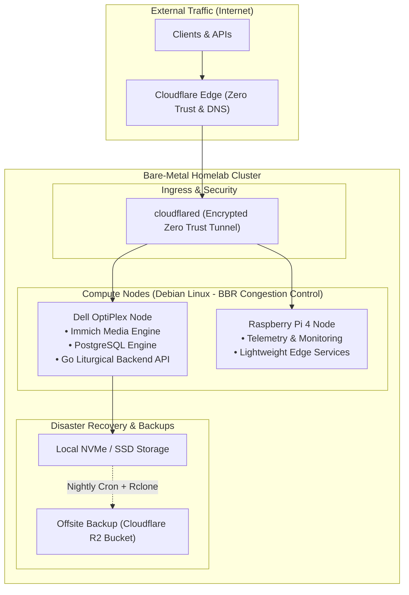

  <h1>Hi, I'm Matheus Dias 👋</h1>
  
<strong>Systems, SRE & Platform Engineer | B.S. Electrical & Telecommunications Engineering</strong>

  
📍 São Paulo / Manaus, Brazil · 💼 Open to Remote Opportunities

  

    
    
  

 

### ⚡ About Me
I bridge the gap between **low-level systems, distributed infrastructure, and high-performance client applications**. With a Bachelor's in **Electrical & Telecommunications Engineering** and 6+ years in software engineering, I design fault-tolerant systems, automate bare-metal Linux infrastructure, tune TCP network kernels, and architect resilient applications at scale.

- 🔭 **Currently Building:** Distributed bare-metal homelab infrastructure (OptiPlex + Raspberry Pi), high-concurrency Go backends, and network resilience packages.
- 🛠 **Engineering Focus:** Site Reliability Engineering (SRE), Linux Kernel Tuning (BBR, TCP buffer sizing), IaC, Containerization, and Observability.
- 🎓 **Academic Background:** B.S. in Electrical and Telecommunications Engineering (UniNorte) & Electronics Technician (IFAM).
- 📜 **Published Thesis:** *"IoT Data Center Environmental Telemetry & Real-Time Alert System on Raspberry Pi"*.

---

### 🛠 Tech Stack & Core Competencies

| Domain | Technologies |
| :--- | :--- |
| **Systems & Backend** | **Go (Golang)**, Linux (Debian, systemd, sysctl), Docker, REST/gRPC, WebSockets, SQL |
| **SRE & Infrastructure** | **Infrastructure-as-Code**, Kernel Tuning (BBR, swappiness), Cloudflare Zero Trust Tunnels, Tailscale, R2 Automated Backups, Prometheus, Grafana |
| **Client & Mobile Platform** | **Flutter**, **Dart**, **Native Android (Kotlin/Java)**, WASM, Offline-first sync architectures, Crashlytics (99.8%+ crash-free rate) |
| **Hardware & Telecom** | Distributed Homelabs, Telecommunications networks, Embedded Android POS terminals, IoT sensor pipelines |

---

### 🏗 Distributed Homelab Architecture (Production-at-Home)

---

### 🚀 Featured Engineering Repositories

* 🐧 **[homelab-infrastructure](https://github.com/Mathvdias/homelab-infrastructure)** — Infrastructure-as-Code for distributed bare-metal homelab running Linux (Debian), containerized microservices, kernel-level network optimizations (BBR, swappiness), and automated offsite backups to Cloudflare R2.
* ⚡ **[intercepted_http](https://github.com/Mathvdias/intercepted_http)** — A composable HTTP interceptor layer for `package:http`. Automatic OAuth2/JWT token refresh, exponential backoff retries, and observability telemetry with 100% test coverage.
* 🖥 **[portfolio](https://github.com/Mathvdias/portfolio)** — Desktop-inspired portfolio built with Flutter compiled to WebAssembly (WASM), featuring draggable window management, spotlight search, and comprehensive unit/widget tests.

---

  <i>"In God we trust; all others must bring data." — W. Edwards Deming</i>

